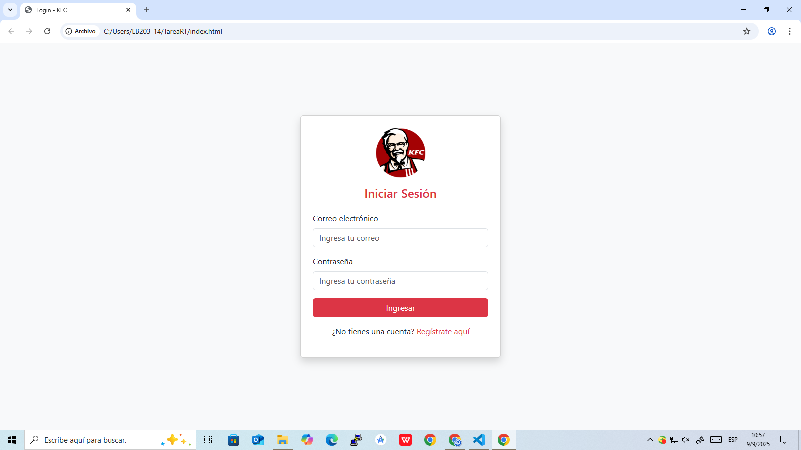

# 🍗 KFC Login

Este proyecto es una interfaz de inicio de sesión (login) para el sistema de KFC. Está diseñado para autenticar usuarios de forma segura y brindar una experiencia intuitiva y moderna, siguiendo la identidad visual de la marca KFC.

---

## 🚀 Tecnologías utilizadas

- HTML5
- CSS3 / SCSS
- Bootstrap

---

## 🧩 Funcionalidades

- Inicio de sesión con validación de campos
- Diseño responsive (adaptado a dispositivos móviles y escritorio)
- Indicaciones de error en tiempo real
- Estética basada en la marca KFC
- (Opcional: Autenticación con backend / JWT / Sesiones)

---

## 🖼️ Captura de pantalla



---

## 🛠️ Cómo usar

1. Clona el repositorio:

   ```bash
   git clone https://github.com/Zaida-tm18/kfc-login.git
   cd kfc-login
   ```

2. Abre el archivo `index.html` en tu navegador.

3. ¡Listo! Ahora puedes probar el formulario de inicio de sesión.

